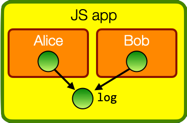

# lavamoat-demo

Demo on how to use [lavamoat](https://github.com/LavaMoat/LavaMoat/) and [secure ecmascript](https://github.com/endojs/endo/tree/master/packages/ses) (SES) to isolate js modules, accompanying my [talk slides](https://tvcutsem.github.io/assets/HardenedJS_BlueLava2022.pdf) on hardened javascript, object-capabilities and the Principle of Least Authority ("POLA").

Specifically, we demonstrate [lavamoat-node](https://github.com/LavaMoat/LavaMoat/tree/main/packages/node), a way to run JavaScript modules in an SES sandbox on nodejs.

# installation

Make sure you have nodejs v18+ installed and run:

```
npm install
```

# scenario

The `setup1.js` code loads two modules `alice` and `bob` and gives them access to a shared `log` object. For simplicity, the log is implemented as an array of string messages.

The POLA access control policy we want to enforce is that `alice` can only **write** to the log, while `bob` can only **read** from the log.



See the example code in the [slides](https://tvcutsem.github.io/assets/HardenedJS_BlueLava2022.pdf) to follow along.

## running the scenario without lavamoat/ses

We first show various ways Bob can circumvent the read-only restrictions on the log. See `attack 1` through `attack 4` in `bob.js`.

To run through a scenario where Bob does not stage an attack:

Run `node setup1.js` or `npm run node`

Without attacks, the output of the code should be:

```
lavamoat-demo % node setup1.js 
alice: writing to log
bob: reading the log:  [ 'alice' ]
log contents:  [ 'alice' ]
```

To run through a scenario where bob executes one of the attacks, pass a command-line arg of "1" through "4". For example, to let bob run attack 1:

```
lavamoat-demo % node setup1.js 1
alice: writing to log
Bob's evil push function
bob: reading the log:  []
log contents:  []
```

Here we can see the effect of Bob poisoning `Array.prototype.push`, causing Alice's write to get lost.

## running the scenario with lavamoat/ses

Lavamoat will run the code in an isolated SES sandbox with frozen 'primordial' objects where prototype poisoning attacks will fail.

The file `setup2.js` assumes it will run in an SES sandbox, where functions like `harden()` are available globally.

To run the module using lavamoat, first let lavamoat generate a policy file:

```
npm run lavamoat-init
```

This will generate a `lavamoat/node/policy.json` file establishing the privileges of any package dependencies (none in this example).

Then run the code using the lavamoat cli tool:

```
lavamoat-demo % npm run lavamoat

> lavamoat
> npx rollup -c && npx lavamoat bundle.js


setup2.js → bundle.js...
created bundle.js in 30ms
Removing intrinsics.Object.hasOwn
Removing intrinsics.%ArrayPrototype%.findLast
Removing intrinsics.%ArrayPrototype%.findLastIndex
Removing intrinsics.%ArrayPrototype%.@@unscopables.findLast
Removing intrinsics.%ArrayPrototype%.@@unscopables.findLastIndex
Removing intrinsics.%TypedArrayPrototype%.findLast
Removing intrinsics.%TypedArrayPrototype%.findLastIndex
alice: writing to log
bob: reading the log:  [ 'alice' ]
log contents:  [ 'alice' ]
```

(The "Removing..." messages are warnings printed by the SES sandboxing script, indicating that it found non-standard properties on built-in objects.)

If Bob now tries to run `attack 1` the output will be:

```
lavamoat-demo % npm run lavamoat 1

> lavamoat
> npx rollup -c && npx lavamoat bundle.js 1


setup2.js → bundle.js...
created bundle.js in 20ms
Removing intrinsics.Object.hasOwn
Removing intrinsics.%ArrayPrototype%.findLast
Removing intrinsics.%ArrayPrototype%.findLastIndex
Removing intrinsics.%ArrayPrototype%.@@unscopables.findLast
Removing intrinsics.%ArrayPrototype%.@@unscopables.findLastIndex
Removing intrinsics.%TypedArrayPrototype%.findLast
Removing intrinsics.%TypedArrayPrototype%.findLastIndex
TypeError: Cannot assign to read only property 'push' of 'root.%ArrayPrototype%.push'
  at Array.setter (LavaMoat/node/kernel:7953:17)
  at initBob (eval at <anonymous> (eval at makeEvaluateFactory (LavaMoat/node/kernel)), <anonymous>:17:34)
  at Object.eval (eval at <anonymous> (eval at makeEvaluateFactory (LavaMoat/node/kernel)), <anonymous>:68:13)
  at Object.internalRequire (LavaMoat/core/kernel:533:27)
  ...
```

In other words, the attack fails with a `TypeError` since `Array.prototype` is now immutable.

Attacks 2, 3 and 4 will also fail under the new setup and when executed in lavamoat.

## misc notes

We use [rollup](https://rollupjs.org/guide/en/) to compile `setup2.js` into a standard commonjs bundle without JS module syntax before feeding it to lavamoat.

Trying to run lavamoat directly on `setup2.js` fails, apparently because it cannot deal with import syntax. If you know a fix for this, let me know. It looks like ESM module support is [on the lavamoat roadmap](https://github.com/LavaMoat/LavaMoat/issues/389#issuecomment-1325226403).

```
% npx lavamoat setup2.js
Removing intrinsics.Object.hasOwn
Removing intrinsics.%ArrayPrototype%.findLast
Removing intrinsics.%ArrayPrototype%.findLastIndex
Removing intrinsics.%ArrayPrototype%.@@unscopables.findLast
Removing intrinsics.%ArrayPrototype%.@@unscopables.findLastIndex
Removing intrinsics.%TypedArrayPrototype%.findLast
Removing intrinsics.%TypedArrayPrototype%.findLastIndex
LavaMoat - Error evaluating module "/setup2.js" from package "$root$" 
SyntaxError: Cannot use import statement outside a module
  at Object.eval (eval at makeEvaluateFactory (LavaMoat/node/kernel), <anonymous>:8:30)
  at performEval (LavaMoat/node/kernel:4157:12)
  ...
```